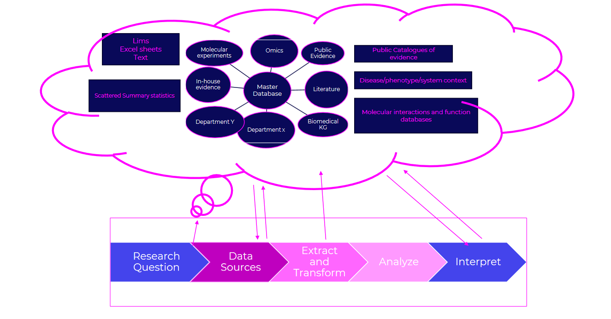

## Life Science data

A great emphasis on the re-usability of life science data has been placed due to recent technological advances, including the feasibility of complex data generation, computational infrastructure, and algorithmic advances. These advancements have the potential to revolutionize biomedical research, allowing for more detailed and comprehensive data collection and analysis. However, significant bottlenecks remain, rooted in experiment and trial design. Despite the technological progress, these bottlenecks can hinder the effective use of data. Sensible target predictions in drug and biomarker discovery require extensive efforts in data engineering, harmonization, and validation. Ensuring that data is well-organized, standardized, and verified is essential for making reliable and impactful scientific discoveries.

### Data about data (metadata) is important

Data about data (metadata) is crucial in biomedical research. Biomedical assays and experiments are carried out in specific contexts, with measurements and readouts that are highly dependent on the assay and technology used. As data processing methods, algorithms, and analytical pipelines evolve, the context and methods of data collection must be clearly documented to ensure accurate interpretation. Metadata allows researchers to track these changes and revisit source data and evidence as needed. Without thorough metadata, the risk of prioritizing the wrong targets remains high, as crucial details about how the data was generated and processed can be lost. Proper metadata ensures transparency, reproducibility, and reliability in research, enabling better decision-making and more accurate conclusions.

### Emphasize on what data should be produced?

As data acquisition becomes more feasible at a large scale, managing, analyzing, and reusing this data becomes a greater challenge than its initial acquisition. It is crucial to focus on the quality and relevance of data produced. Data should be well-structured, annotated, and aligned with specific research objectives. Before generating new data, a thorough investigation of existing data and evidence should be performed to avoid redundancy and ensure that new data fills critical gaps. Proper curation and validation processes should be in place to maintain high standards of data integrity.

### Data black hole to AI black box to drug targets? not so fast!

Presenting all available data to AI models in hopes of generating meaningful drug candidates is tempting but challenging. AI holds promise in drug discovery, but the process is complex.

Biomedical data is vast, unstructured, and noisy, including genetic sequences and clinical trial results. Feeding unrefined data into AI models without proper preprocessing can lead to errors. AI models are only as good as the data they are trained on.

AI models operate as "black boxes," with opaque decision-making processes. This lack of transparency is problematic in drug discovery, where understanding mechanisms of action is crucial.

Human biology's complexity, influenced by genetic variability and environmental factors, may not be fully captured by AI, leading to oversimplified predictions.

Implementing AI in drug discovery requires caution due to potential risks like misguided predictions, wasted resources, and ethical considerations.

In conclusion, AI has potential in drug discovery, but robust data curation, model transparency, and understanding biological complexity are essential. Collaboration between data scientists, biologists, and clinicians is crucial to maximize AI's benefits.

### Don´t Look back. Please DO! Better yet, let someone else look at it.

After investing significant effort in setting up experiments and analyzing data from omics platforms, it can be tempting to settle for the initial list of candidate drug targets. However, exhaustion and tight timelines often limit the thorough exploration of this data. To avoid missing valuable insights, it is crucial to have an external review by fresh eyes or a different team. This additional scrutiny can uncover overlooked patterns, validate findings, and ensure a more comprehensive understanding of the results. By leveraging diverse expertise, the quality and robustness of the candidate list can be significantly enhanced.

### Enable the scientists and decision makers!

Data curation, representation, and the ability to query data at all stages of drug and biomarker discovery should be as straightforward as possible for everyday integration. Emphasis must be on enabling teams, scientists, and decision makers to explore research and strategic questions using relevant data effectively. Harmonization of data sources, clear representation, and an easy-to-use interface to explore the data are crucial for making informed decisions and accelerating research pipelines. For patients, this could mean life-saving treatments and an improved quality of life. For organizations, it translates to solving more societal problems efficiently. By simplifying data interaction, we empower researchers and strategists to leverage data fully, driving innovation and success in biomedical research.
